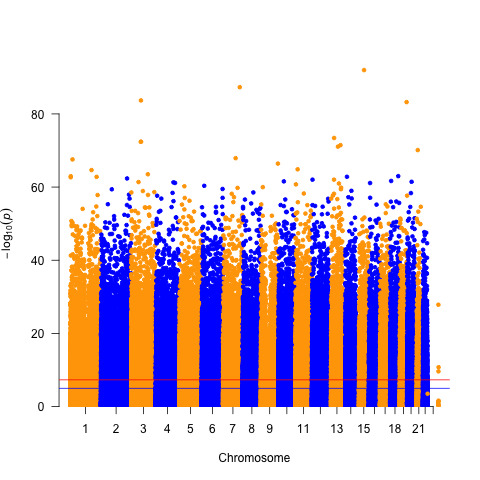
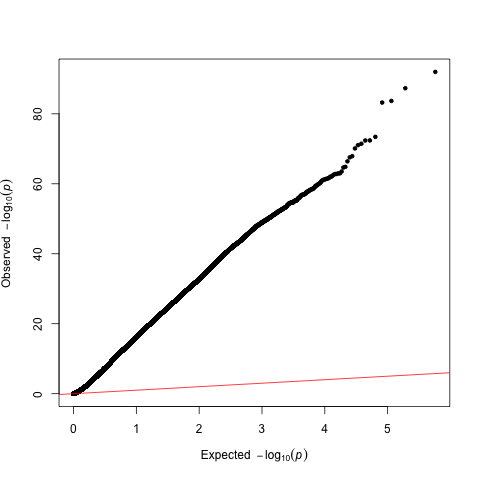
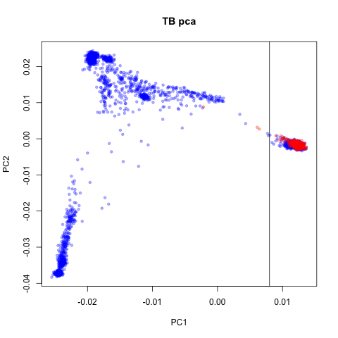
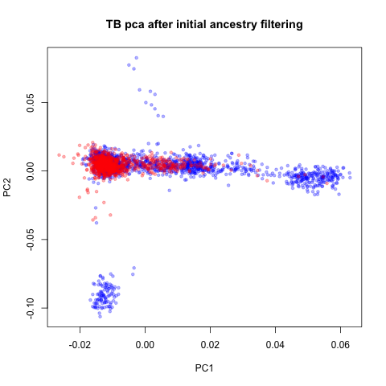
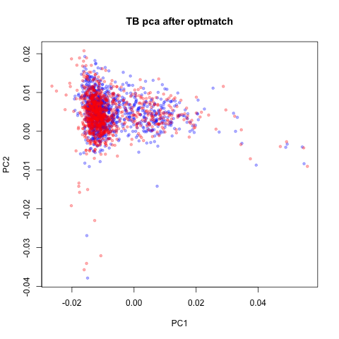
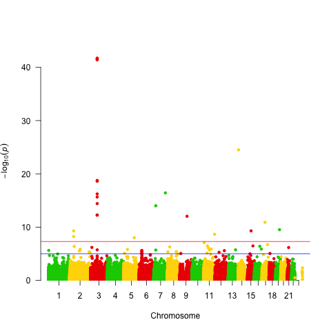
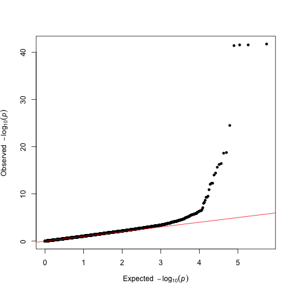

## GWAS data

I downloaded some example data from dbGaP. These data were for running through methods only and do not represent a valid GWAS comparison. Here are the commands I used do download these data.

```sh
# download ped and map for 1008 TB cases
wget ftp://ftp.ncbi.nlm.nih.gov/geo/series/GSE83nnn/GSE83397/suppl/GSE83397_project1008s.ped.gz
wget ftp://ftp.ncbi.nlm.nih.gov/geo/series/GSE83nnn/GSE83397/suppl/GSE83397_project1008s.map.gz
# download 1000G SNP chip data to use as controls
wget ftp://ftp.1000genomes.ebi.ac.uk/vol1/ftp/release/20130502/supporting/hd_genotype_chip/ALL.chip.omni_broad_sanger_combined.20140818.snps.genotypes.vcf.gz
wget ftp://ftp.1000genomes.ebi.ac.uk/vol1/ftp/release/20130502/supporting/hd_genotype_chip/ALL.chip.omni_broad_sanger_combined.20140818.snps.genotypes.vcf.gz.tbi
#download some additional data from Chinese population run on the same chip as TB cases to use as controls
wget ftp://ftp.ncbi.nlm.nih.gov/geo/series/GSE69nnn/GSE69664/suppl/GSE69664_GPL19864_processed_data.txt.gz
wget ftp://ftp.ncbi.nlm.nih.gov/geo/series/GSE69nnn/GSE69664/suppl/GSE69664_GPL20166_processed_data.txt.gz
```

I then converted all data to plink binary format, mapped to reference strand, and merged keeping only SNPs in the intersection of all data sets.
The merged datasets are in the directory `plink_start`. You can download the files from here (using wget):

https://proj-bip-prod-publicread.s3.amazonaws.com/training/GWAS_tutorial/plink_start.zip

Or they are available on biocompace.icermali.org.

## GWAS Tutorial

Let's start by checking the files in `plink_start`.

```sh
ls plink_start/*
```

You'll see these files:
```sh
plink_start/TB_GWAS.bed
plink_start/TB_GWAS.bim
plink_start/TB_GWAS.fam
```

This is a plink binary dataset. You can see more about PLINK file formats here: https://www.cog-genomics.org/plink/1.9/formats. It is required to have a "bed", "bim", and "fam" file. The "bed" file is binary and we can't look at it easily. But we can count the number of lines in the "bim" file to see the number of SNPs and count the number of lines in the "fam" file to see the number of samples.

```sh
wc -l plink_start/TB_GWAS.bim
wc -l plink_start/TB_GWAS.fam
```

The "fam" file contains some phenotype data. Let's explore this more in R.

```R
pheno <- read.table("plink_start/TB_GWAS.fam")
head(pheno)
```

You can see that there is not a header line in this file. Let's add names to the columns in this dataframe.

```R
names(pheno) <- c("fam", "ind", "father", "mother", "sex", "affected")
```

Now we can look at the counts for some of the phenotypes.

```R
table(pheno$sex)
```

This is not really interesting. They are all "0". This means that sex is not known for these samples. We could determine sex from the genotype data, but we're not going to worry about that in this tutorial.

```R
table(pheno$affected)
```

So looks like 1008 cases and 3307 controls. We can try to run the GWAS with about 3:1 controls to cases, but let's do same basic data quality filtering first. We're going to use PLINK for this. PLINK has a lot of commands.

```sh
plink --help
```

We certainly won't go through most of these commands, but you are incouraged to read the documentation on your own. For quality filtering we will remove samples with more than 5% of SNPs missing, SNPs with more than 5% of samples missing, SNPs with minor allele frequency < 5%, and SNPs that are out of Hardy-Weinberg equilibrium.

```sh
plink --bfile plink_start/TB_GWAS --mind 0.05 --geno 0.05 --maf 0.05 --hwe 0.0001 --allow-no-sex --make-bed --out qc1/TB_GWAS
```

You can see the results of this filtering in the log file and in STDOUT. Now that we have done some quality filtering let's run our association test.

```sh
plink --bfile qc1/TB_GWAS --assoc fisher --adjust --allow-no-sex --out assoc1/TB_GWAS
```

Let's look at the results in "assoc1/TB_GWAS.assoc.fisher" using R.

```R
data <- read.table("assoc1/TB_GWAS.assoc.fisher", head = T)
names(data)
summary(data$P)
min(data$P)
require(qqman)
#The minimum p value is used to determine the top of the ylim
manhattan(data, col = c("orange", "blue"), ylim = c(0, 95))
```

You should see a manhattan plot that looks like this:




```sh
#make qq plot also
qq(data$P)
```
And a QQ plot that looks like this:



There seems to be some major genomic inflation in these data. It's clear that something wasn't controlled for correctly. You can also see this with the "lambda" value that's in the output from the PLINK `--assoc` command above. The lambda value should be close to 1.0. This lambda is extremely high. Can you think of something that would cause this?


Before we ran the association test we should make sure that the cases and controls are matched by ancestry. There are other software programs that we can use to check ancestry from SNP chip data. On is called SNPWEIGHTS: https://www.hsph.harvard.edu/alkes-price/software/. We won't use that software in this tutorial, but we'll be able to get an idea of ancestry by running pca using PLINK.

```sh
plink --bfile qc1/TB_GWAS --pca 6 header --allow-no-sex --out pca1/TB_GWAS
```

The pca command may take a few minutes to run. We're just going to output the first 6 principle components, and we're telling PLINK to include a header line in the output file. Let's look at the pca results in R.

```R
data <- read.table("pca1/TB_GWAS.eigenvec", head = T)
##plot PC1 vs PC2
plot(data$PC1, data$PC2)

#it would be useful to color the points by Ca/Co status

pheno <- read.table("qc1/TB_GWAS.fam")
head(pheno)
names(pheno) <- c("fam", "ind", "father", "mother", "sex", "affected")
head(pheno)

case <- pheno$affected == 2
control <- pheno$affected == 1
plot(data$PC1, data$PC2, type = "n", xlab = "PC1", ylab = "PC2", main = "TB pca")
points(data$PC1[control], data$PC2[control], col = rgb(0,0,1, 0.3), pch = 20)
points(data$PC1[case], data$PC2[case], col = rgb(1,0,0, 0.3), pch = 20)
#let's make a line at a good cutoff for PC1
abline(v = 0.008)

#subset to just PC1 > 0.008

keep_data <- subset(data, PC1 > 0.008, select=c(FID, IID))
write.table(keep_data, "ancestry_filt1/samples_to_keep.txt", quote = F, row.names = F, col.names = F)
```

The PCA plot should look like this:




Now we can use PLINK to subset the data to the cases and controls that seem to be ancestry matched from pca and repeat association test.

```sh
plink --bfile qc1/TB_GWAS --keep ancestry_filt1/samples_to_keep.txt --make-bed --out ancestry_filt1/TB_GWAS
##run association test on subset data
plink --bfile ancestry_filt1/TB_GWAS --assoc fisher --adjust --allow-no-sex --out assoc2/TB_GWAS
```

We could make the manhattan and QQ plots again, but it's obvious from the lambda value in the PLINK output that there is still evidence for genomic inflation. Because PCA of the genotypes gives a relative value of distance the results will change if different samples are included. Because of this we should run PCA again on our new ancestry matched data and look for evidence of substructure.

```sh
plink --bfile ancestry_filt1/TB_GWAS --pca 6 header --allow-no-sex --out pca2/TB_GWAS
```

And we should plot these as before in R

```R
data <- read.table("pca2/TB_GWAS.eigenvec", head = T)
pheno <- read.table("ancestry_filt1/TB_GWAS.fam")
names(pheno) <- c("fam", "ind", "father", "mother", "sex", "affected")
case <- pheno$affected == 2
control <- pheno$affected == 1
plot(data$PC1, data$PC2, type = "n", xlab = "PC1", ylab = "PC2", main = "TB pca after initial ancestry filtering")
points(data$PC1[control], data$PC2[control], col = rgb(0,0,1, 0.3), pch = 20)
points(data$PC1[case], data$PC2[case], col = rgb(1,0,0, 0.3), pch = 20)
```



There is still substructure in the data. We will use the R package `optmatch` to better match controls to cases.

```sh
# optmatch requires 0 for control and 1 for cases
data$CaCo <- pheno$affected - 1
table(data$CaCo)

require(optmatch)
pm <- pairmatch(CaCo ~ PC1 + PC2 + PC3, controls = 1, data = data, remove.unmatchables = T)
data2 <- data[which(!is.na(pm)),]
table(data2$CaCo)

#plot after matching
case <- data2$CaCo == 1
control <- data2$CaCo == 0
plot(data2$PC1, data2$PC2, type = "n", xlab = "PC1", ylab = "PC2", main = "TB pca after optmatch")
points(data2$PC1[control], data2$PC2[control], col = rgb(0,0,1, 0.3), pch = 20)
points(data2$PC1[case], data2$PC2[case], col = rgb(1,0,0, 0.3), pch = 20)

#output samples to subset
head(data2)
head(data2[,1:2])

write.table(data2[,1:2], "ancestry_filt2/samples_to_keep.txt", quote = F, row.names = F, col.names = F)
```


Now I can subset to this list of ancestry matched cases and controls using PLINK. And repeat the association test on the subset data.

```sh
plink --bfile ancestry_filt1/TB_GWAS --keep ancestry_filt2/samples_to_keep.txt --make-bed --out ancestry_filt2/TB_GWAS
plink --bfile ancestry_filt2/TB_GWAS --assoc fisher --adjust --allow-no-sex --out assoc3/TB_GWAS
```

The lambda value looks good now in the PLINK output. Now let's make the manhattan and QQ plots from `assoc3` in R.

```R
data <- read.table("assoc3/TB_GWAS.assoc.fisher", head = T)
names(data)
summary(data$P)
min(data$P)

require(qqman)
manhattan(data, col = c("green3", "gold", "red2"), ylim = c(0, 45))
```

```sh
#make qq plot also
qq(data$P)
```


Those plots look much better and have some association signals worth following up on.
