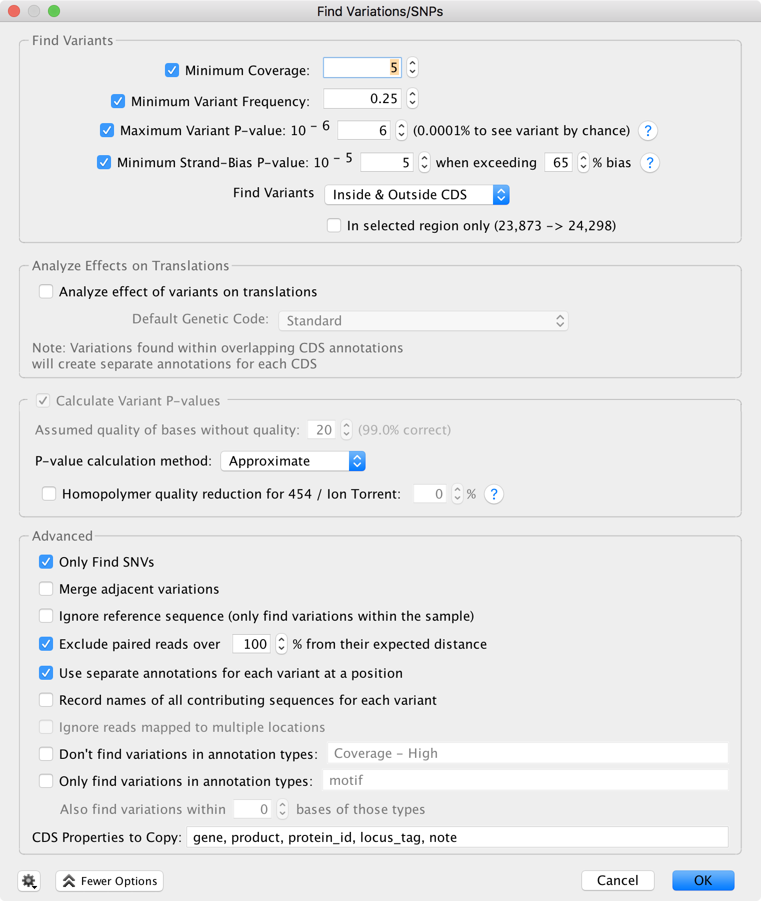

# Ebola strains

Samples from the 2014 West African outbreak collected U.S. Army Medical Research Institute of Infectious Diseases.

1. Files are located on Locus in the ebov directory.  Everyone has a different sample/strain.  
2. Run FastQC and MultiQC and examine quality.
3. Trim the data using BBDuk.
4. Build a Bowtie2 index from the [NC_002549](https://www.ncbi.nlm.nih.gov/nuccore/NC_002549) reference genome and map the reads against the reference.
5. **Extra**  On Locus, copy your SAM file to the shared qc_data directory.

```bash
cp ./samfilename.sam /classhome/qc_data/
```

6. View the mapping in Geneious.
7. To find SNPs, look under Annotate and Predict for Find Variations/SNPs...




8. Download others' sam files from /classhome/qc_data in Cyberduck.  We can do a comparative analysis of all the Ebola samples in Geneious. Tutorial [here](https://assets.geneious.com/documentation/geneious/App+Note+-+Creating+SNP+Trees+in+Geneious.pdf).  
