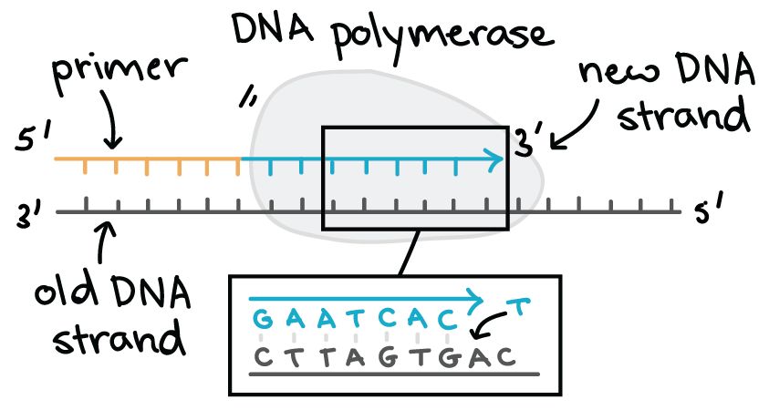
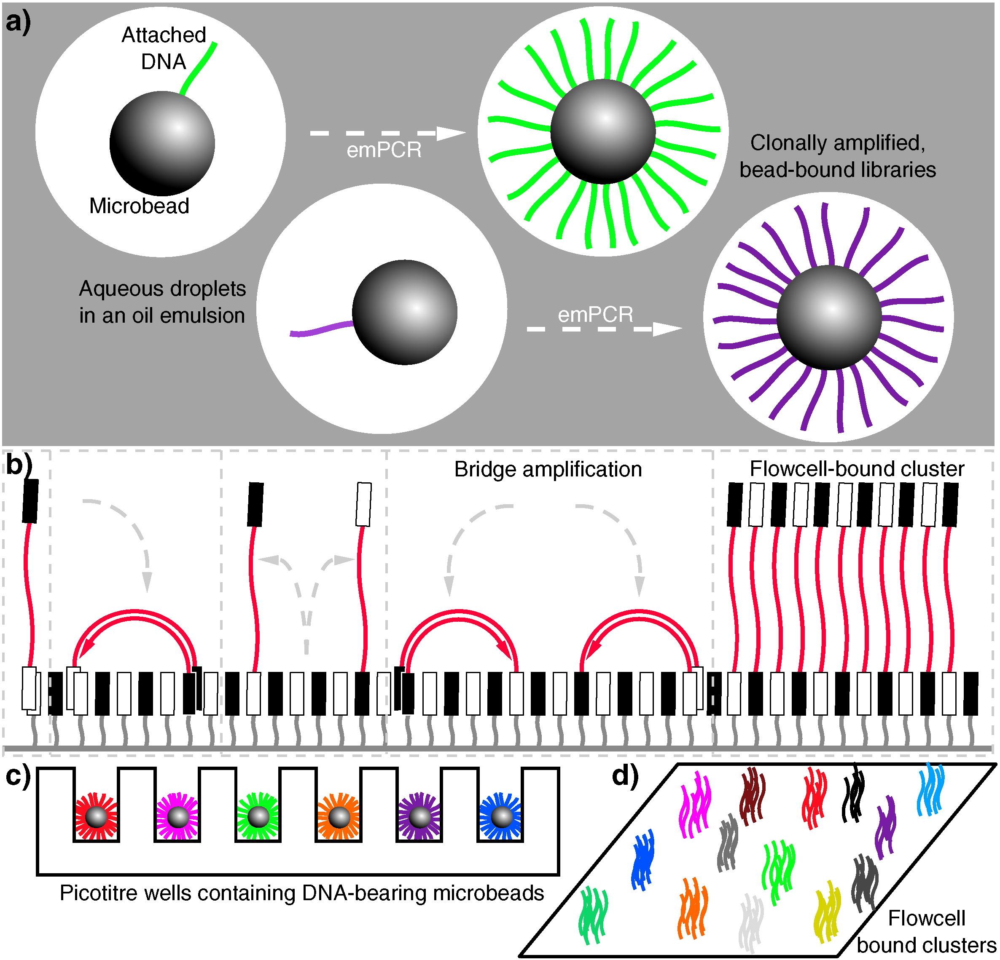
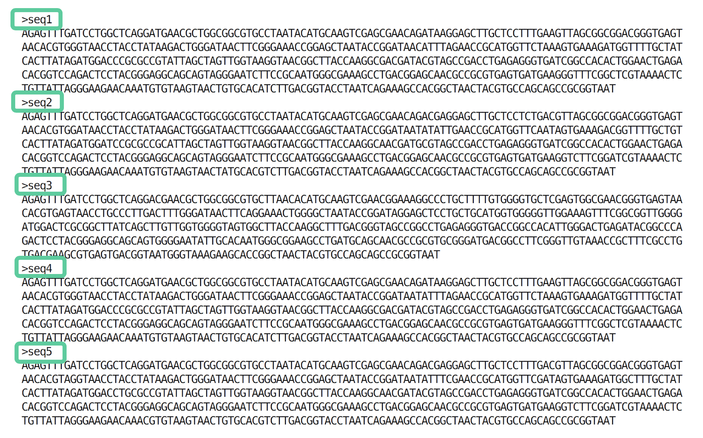
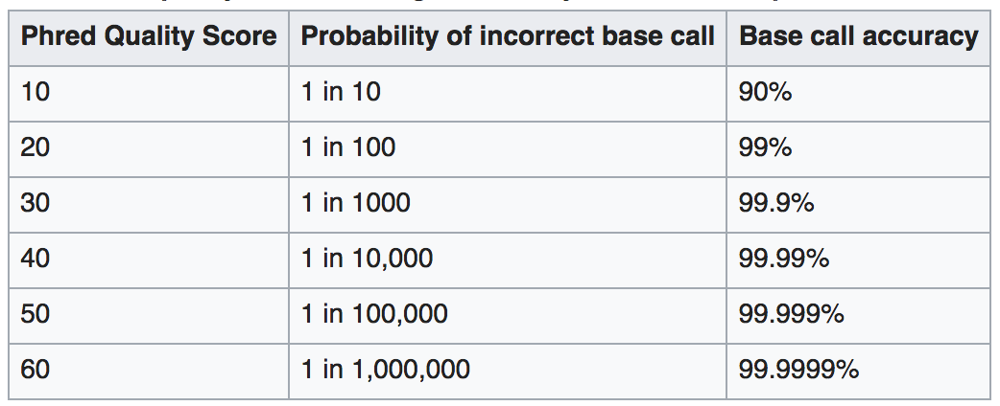

Introduction to Sequence QC
===========================

Bioinformatics and Computational Biosciences Branch Seminar

4 March 2019

Poorani Subramanian, Computational Biology Specialist

BCBB Science Support
--------------------

-   [bioinformatics.niaid.nih.gov](https://bioinformatics.niaid.nih.gov)
-   More help email: <bioinformatics@niaid.nih.gov>
    

------------------------------------------------------------------------

Why is sequencing challenging?
------------------------------

-   The point of sequencing is not adding the next base
-   The point of sequencing is to **figuring out what that next base
    added is**
-   **This is where the various sequencing technologies differ**
    

------------------------------------------------------------------------

Short History of Sequencing 1
-----------------------------

-   First generation
-   Coulson & Sanger ‘plus and minus’ (1975) – first DNA genome
    sequenced *ϕ* X174 bacteriophage
-   Maxam and Gilbert chemical cleavage (1977)
-   Sanger sequencing – chain-termination (1977)
    

------------------------------------------------------------------------

Short History of Sequencing 2
-----------------------------

**Next-generation (NGS) – short read**

-   454 Life Sciences – pyrosequencing (now defunct)
    -   Parallelization of the sequencing reactions
    -   First high-throughput sequencing machine
-   **Solexa** **/Illumina** – SBS: sequencing by synthesis
    -   Fluorescent reversible-terminator
    -   Read length \~ 150-300bp
-   Other methods – ABI SOLiD (defunct) and Ion Torrent

------------------------------------------------------------------------

Short History of Sequencing 3
-----------------------------

-   Third generation - long read
-   Sometimes characterized by not needing amplification – potentially
    sequencing entire single molecules (SMS)
-   PacBio – SMRT
    -   Fast
    -   \~10kb
    -   Error rate only a little higher than short read
-   Oxford Nanopore – ION
    -   Faster and cheaper
    -   Error rates are higher than for short reads
    -   5-10kb
-   10X Genomics
    -   New methods of barcodes/indexing

------------------------------------------------------------------------

File Formats
============

------------------------------------------------------------------------

File Formats
------------

-   Sequence Data
    -   FASTA/QUAL
    -   FASTQ
    -   FAST5 - nanopore
    -   Older formats – sff
-   Alignment Data
    -   SAM
    -   BAM
    -   BED

------------------------------------------------------------------------

FASTA and/or QUAL
-----------------

-   Sequence and quality scores are separate files – old data
-   Or FASTA only with no quality data available
    -   Pre-processed in some way
-   Header
-   Sequence
    -   All on one line
    -   Or it will be truncated – 80-120 characters
        

------------------------------------------------------------------------

FASTQ
-----

-   Sequence and quality in single file

<!-- -->

    @M03213:59:000000000-AWR6D:1:1101:12406:1145 1:N:0:NCCTGAGC+NTATTAAG
    GTGCCAGCAGCCGCGGTAATACGGAGGGTGCGAGCGTTAATCGGAATAACTGGGCGTAAAGGGCACGCAGGCGGATTTTTAAGTGAGGTNTGAAAGCCCCGGGCTTAACCTGGGAATTGCATTTCAGACTGGGAATCTAGAGTACTTTAGGGAGGGGTAGAATTCCACGTGTAGCGGTGAAATGCGTAGAGATGTGGAGGAATACCGAAGGCGAAGGCAGCCCCTTGGGAATGTACTGNCGCTCATGGTCGAACGCGTGGG

    @<instrument>:<run number>:<flowcell>:<lane>:<tile>:<x-pos>:<y-pos>  <read>:<is filtered>:<control number>:<sample number>

### Header

-   Read identifier is the beginning part (before the space)
-   The end part (after the space) is used for demuxing or PE
    information

### Raw sequence

-   All on one line - no spaces - DNA or RNA, should be one of the IUPAC
    characters.

------------------------------------------------------------------------

FASTQ Quality Scores
--------------------

-   Sequence and quality in single file

<!-- -->

    @M03213:59:000000000-AWR6D:1:1101:12406:1145 1:N:0:NCCTGAGC+NTATTAAG
    GTGCCAGCAGCCGCGGTAATACGGAGGGTGCGAGCGTTAATCGGAATAACTGGGCGTAAAGGGCACGCAGGCGG
    +
    -6,ACGGAEFGGG<<FFG?FC@EF8AFCFGEGGCCCBGGGGGGDGGGGGEEFA<FGCE,EFDCFFFGGGGCCDG

-   Quality Scores
-   Phred quality scores: Let *p* be the the probability that the
    corresponding base call is incorrect, then
-   Additive constant - Q+C – encoded in ASCII
-   Usually, constant is 33 – Phred+33
-   40 is usually highest score – very, very rarely up to 60
-   Illumina &gt; 1.8 \~2011

-   [ASCII table
    reference](https://www.cs.cmu.edu/~pattis/15-1XX/common/handouts/ascii.html)

------------------------------------------------------------------------

Convert from FASTQ to FASTA
---------------------------

-   FASTX-Toolkit
-   SRA-toolkit – download data and automatically convert

------------------------------------------------------------------------

Sequence data
-------------

-   What it looks like, types, quality

------------------------------------------------------------------------

Single End vs Paired End
------------------------

------------------------------------------------------------------------

Adapters, Primers, Indexes
--------------------------

-   Reads from a sequencer may have extra sequences on either end that
    we should remember are there
-   Indexes are used by the sequencer to separate data into separate
    sample files – **demultiplex** 

------------------------------------------------------------------------

Anatomy of an Illumina Run
--------------------------

-   What comes out of the sequencer? 

------------------------------------------------------------------------

Converting and Demultiplexing
-----------------------------

-   Illumina sequencer can convert & demux itself
-   [bcl2fastq](https://support.illumina.com/sequencing/sequencing_software/bcl2fastq-conversion-software.html)
    -   Converts BaseCalls to FASTQ
    -   Demultiplexes the data
        -   Reads that it can’t figure out goes into files called
            “Undetermined”
        -   Should check if the Undetermined files are unreasonably
            Large
        -   Uses SampleSheet.csv to map barcodes to samples
-   Other tools
    -   Idemp - <https://github.com/yhwu/idemp>, fastq-pair
        <https://github.com/linsalrob/fastq-pair>

------------------------------------------------------------------------

How to assess data quality?
---------------------------

-   The sequencing lab runs quality-control tests to ensure that the
    actual run was successful.
-   We should run our own QC prior to analysis
    -   We should all be skeptics! To avoid misinterpretation of the
        data due to unexpected bias
-   QC measurements can report the following:
    -   Percent GC in sample reads
    -   Presence of overrepresented kmers and sequences such as adapters
    -   Per base quality score
    -   Distribution of nucleotide bases
-   After mapping reads to a genome, additional test could be run to
    determine:
    -   Mapping error rate
    -   Percent of possible PCR duplicates (reads with same start and
        end position in reference genome)
    -   Distribution of insert size (pair ends)

------------------------------------------------------------------------

Sequencing QC
-------------

-   **FASTQC:**
    <https://www.bioinformatics.babraham.ac.uk/projects/fastqc/>
-   <http://multiqc.info/>
-   BaseSpace Tips:
    <https://blog.horizondiscovery.com/diagnostics/the-5-ngs-qc-metrics-you-should-know>
-   Different types of data require different QC metrics
    -   Example: whole genome shotgun vs amplicon
        <https://www.bioinformatics.babraham.ac.uk/projects/fastqc/>
        [http://multiqc.info/](https://blog.horizondiscovery.com/diagnostics/the-5-ngs-qc-metrics-you-should-know)
        [https://blog.horizondiscovery.com/diagnostics/the-5-ngs-qc-metrics-you-should-know](http://multiqc.info/)

------------------------------------------------------------------------

Improving Data Quality
======================

-   Trimming and Filtering
