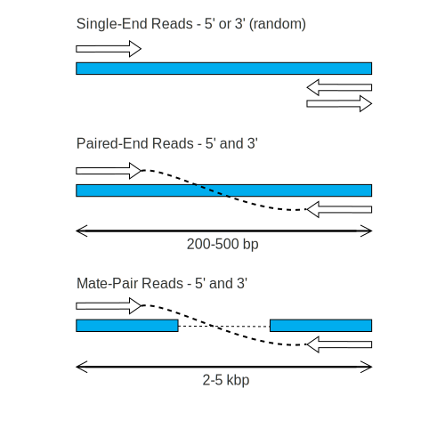
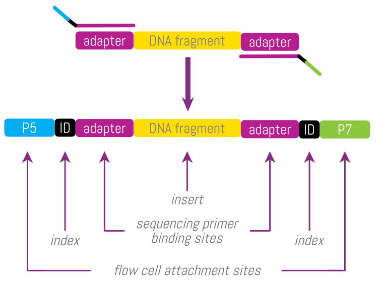
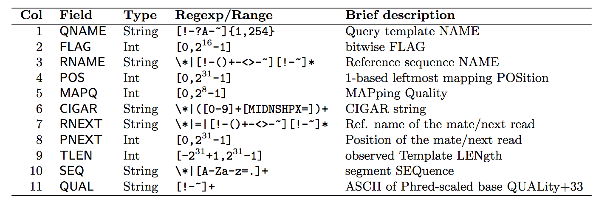
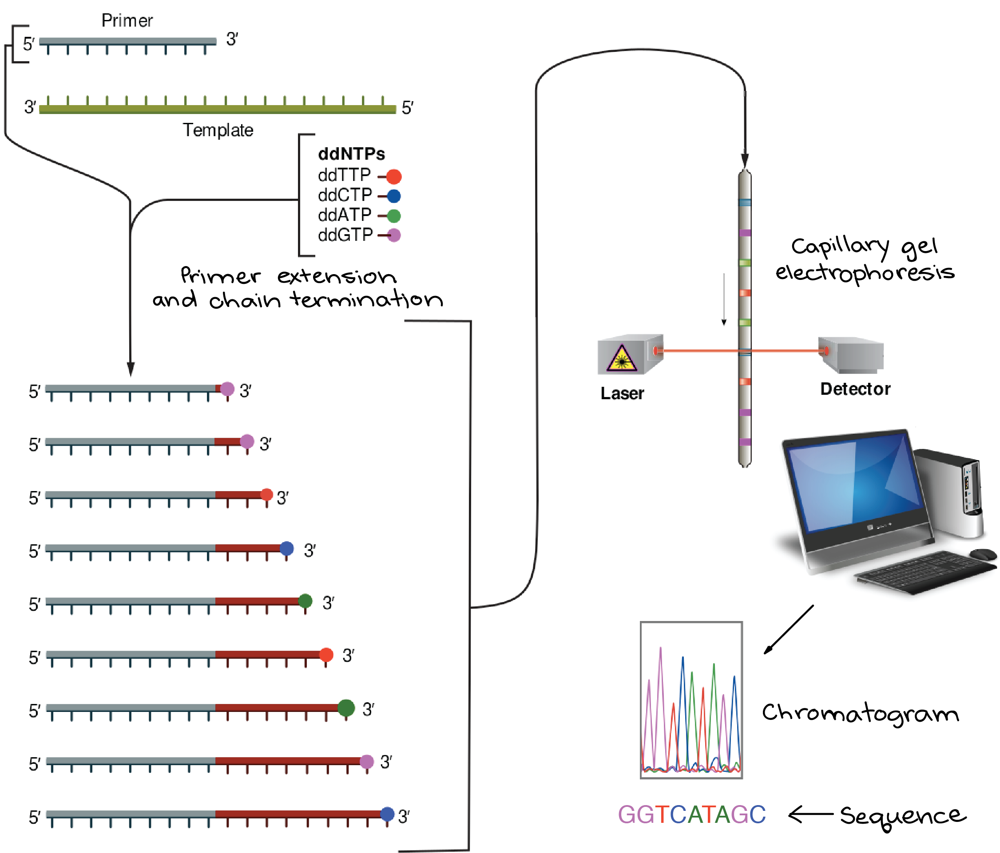

Introduction to Sequence QC
================

Bioinformatics and Computational Biosciences Branch Seminar

Poorani Subramanian, Computational Biology Specialist

4 March 2019

-   [BCBB Science Support](#bcbb-science-support)
-   [Sequencing intro](#sequencing-intro)
-   [Sequence data](#sequence-data)
-   [Files](#files)
-   [Improving Data Quality](#improving-data-quality)
-   [MAPPING](#mapping)
-   [Appendix 1: Short history of
    sequencing](#appendix-1-short-history-of-sequencing)

BCBB Science Support
--------------------

-   [bioinformatics.niaid.nih.gov](https://bioinformatics.niaid.nih.gov)
-   More help email: <bioinformatics@niaid.nih.gov>
    

------------------------------------------------------------------------

Sequencing intro
================

------------------------------------------------------------------------

DNA polymerisation
------------------

-   In nature, during DNA replication, the purpose of DNA polymerisation
    is to the next complementary base to the new strand.
-   The purpose of sequencing is to **figuring out what that next base
    added is**
-   **This is where the various sequencing technologies differ**

------------------------------------------------------------------------

Basic steps: Sample to data
---------------------------

-   Protocol depends on sample type and sequencing type.

1.  Extract the DNA.  
2.  Library preparation.
    -   Fragmenting the DNA.
    -   Adding *adapter* sequences to the ends.
3.  Template amplication\*
    -   Clonal amplification of the fragments to ensure a clear signal.
4.  Sequencing\*

\*3 & 4 take place in the sequencing machine.

------------------------------------------------------------------------

Sequence data
=============

-   What it looks like, types, quality

------------------------------------------------------------------------

Single End vs Paired End vs Mate-Pair
-------------------------------------

------------------------------------------------------------------------

Adapters, Primers, Indexes
--------------------------

-   Reads from a sequencer may have extra sequences on either end that
    we should remember are there
-   Indexes are used by the sequencer to separate data into separate
    sample files – **demultiplex**

------------------------------------------------------------------------

Anatomy of an Illumina Run
--------------------------

-   What comes out of the sequencer? 

------------------------------------------------------------------------

Converting and Demultiplexing
-----------------------------

-   Illumina sequencer can convert & demux itself
-   [bcl2fastq](https://support.illumina.com/sequencing/sequencing_software/bcl2fastq-conversion-software.html)
    -   Converts BaseCalls to FASTQ
    -   Demultiplexes the data
        -   Reads that it can’t figure out goes into files called
            “Undetermined”
        -   Should check if the Undetermined files are unreasonably
            Large
        -   Uses SampleSheet.csv to map barcodes to samples
-   Other tools
    -   Idemp - <https://github.com/yhwu/idemp>, fastq-pair
        <https://github.com/linsalrob/fastq-pair>

------------------------------------------------------------------------

Files
=====

------------------------------------------------------------------------

File Formats
------------

-   Sequence Data
    -   FASTA/QUAL
    -   FASTQ
    -   FAST5 - nanopore
    -   Older formats – sff
-   Alignment Data
    -   SAM
    -   BAM
    -   BED

------------------------------------------------------------------------

FASTA and/or QUAL
-----------------

-   Sequence and quality scores are separate files – old data
-   Or FASTA only with no quality data available
    -   Pre-processed in some way
-   Header
-   Sequence
    -   All on one line
    -   Or it will be truncated – 80-120 characters
        

------------------------------------------------------------------------

FASTQ
-----

-   Sequence and quality in single file

`@M03213:59:000000000-AWR6D:1:1101:12406:1145 1:N:0:NCCTGAGC+NTATTAAG`
`GTGCCAGCAGCCGCGGTAATACGGAGGGTGCGAGCGTTAATCGGAATAACTGGGCGTAAAGGGCACGCAGGCGGATTTTTAAGTGAGGTNTGAAAGCCCCGGGCTTAACCTGGGAATTGCATTTCAGACTGGGAATCTAGAGTACTTTAGGGAGGGGTAGAATTCCACGTGTAGCGGTGAAATGCGTAGAGATGTGGAGGAATACCGAAGGCGAAGGCAGCCCCTTGGGAATGTACTGNCGCTCATGGTCGAACGCGTGGG`

### Header

`@<instrument>:<run number>:<flowcell>:<lane>:<tile>:<x-pos>:<y-pos>  <read>:<is filtered>:<control number>:<sample number>`

-   Read identifier is the beginning part (before the space)
-   The end part (after the space) is used for demuxing or PE
    information

### Raw sequence

-   All on one line - no spaces - DNA or RNA, should be one of the IUPAC
    characters.

------------------------------------------------------------------------

FASTQ Quality Scores
--------------------

-   called **Phred** scores after the inventor **Ph**il Green.

### How are they calculated?

1.  Phred score *Q*: Given *p*, the probability that the corresponding
    base call is incorrect,  
    *Q* = log10*p*.
    -   40 is usually highest score – very, very rarely up to 60
2.  Add constant: *Q* + *C*
    -   usually, *C* = 33 → Phred+33 format is most common
        (Illumina &gt; 1.8 \~2011)
3.  This value, *Q* + *C*, is encoded as an
    [ASCII](https://www.cs.cmu.edu/~pattis/15-1XX/common/handouts/ascii.html)
    character in the FASTQ file.

<!-- -->

    @M03213:59:000000000-AWR6D:1:1101:12406:1145 1:N:0:NCCTGAGC+NTATTAAG
    GTGCCAGCAGCCGCGGTAATACGGAGGGTGCGAGCGTTAATCGGAATAACTGGGCGTAAAGGGCACGCAGGCGG
    +
    -6,ACGGAEFGGG<<FFG?FC@EF8AFCFGEGGCCCBGGGGGGDGGGGGEEFA<FGCE,EFDCFFFGGGGCCDG

*Example*  
First quality character is `-` which is *45* in the ASCII table.  
*Q* = 45 − 33 = 12

???

Line 3 is single ‘+’ <https://> www.cs.cmu.edu /\~ pattis
/15-1XX/common/handouts/ ascii.html

Phred+33 is Sanger standard. Illumina switched around different
standards for a while and settled back to Phred+33. Starting with
Illumina 1.3-1.7 used Phred+64. Illumina 1.5-1.7 if quality scores were
below Q15 at end of read, were arbitrarily assigned score 2 which is B.

------------------------------------------------------------------------

Convert from FASTQ to FASTA
---------------------------

-   FASTX-Toolkit
-   SRA-toolkit – download data and automatically convert

------------------------------------------------------------------------

How to assess data quality?
---------------------------

-   The sequencing lab runs quality-control tests to ensure that the
    actual run was successful.
-   We should run our own QC prior to analysis
    -   We should all be skeptics! To avoid misinterpretation of the
        data due to unexpected bias
-   QC measurements can report the following:
    -   Percent GC in sample reads
    -   Presence of overrepresented kmers and sequences such as adapters
    -   Per base quality score
    -   Distribution of nucleotide bases
-   After mapping reads to a genome, additional test could be run to
    determine:
    -   Mapping error rate
    -   Percent of possible PCR duplicates (reads with same start and
        end position in reference genome)
    -   Distribution of insert size (pair ends)

------------------------------------------------------------------------

Sequencing QC
-------------

-   **FASTQC:**
    <https://www.bioinformatics.babraham.ac.uk/projects/fastqc/>
-   <http://multiqc.info/>
-   BaseSpace Tips:
    <https://blog.horizondiscovery.com/diagnostics/the-5-ngs-qc-metrics-you-should-know>
-   Different types of data require different QC metrics
    -   Example: whole genome shotgun vs amplicon
        <https://www.bioinformatics.babraham.ac.uk/projects/fastqc/>
        [http://multiqc.info/](https://blog.horizondiscovery.com/diagnostics/the-5-ngs-qc-metrics-you-should-know)
        [https://blog.horizondiscovery.com/diagnostics/the-5-ngs-qc-metrics-you-should-know](http://multiqc.info/)

------------------------------------------------------------------------

Improving Data Quality
======================

Trimming and Filtering

------------------------------------------------------------------------

Trimming
--------

-   Adapter/primer trimming
    -   Remove these sequences from the ends of reads
    -   Useful for assembly, amplicon data
-   Quality Trimming
    -   Remove poor quality sequence from ends of reads
    -   Filter out poor quality reads

------------------------------------------------------------------------

Trimming Tools
--------------

-   Cutadapt - <https://> cutadapt.readthedocs.io/en/stable/guide.html
-   Trimmomatic - <http://> www.usadellab.org / cms /?page= trimmomatic
-   **BBDuk** -
    <https://jgi.doe.gov/data-and-tools/bbtools/bb-tools-user-guide/bbduk-guide/>

------------------------------------------------------------------------

MAPPING
=======

------------------------------------------------------------------------

Why do you map reads to a reference?
------------------------------------

-   Reference guided assembly
    -   DNA- seq – genome assembly
    -   RNA- seq – transcriptome assembly
-   Variant calling
-   RNA- seq gene expression
-   Removing host background/contaminants

------------------------------------------------------------------------

Reference Genomes
-----------------

-   Where to get them?
    -   Assemble it yourself
    -   Download it from NCBI – either by searching or by citation
-   Assess their quality
    -   Very few genomes are assembled with care and finished! We need
        to keep our skepticism!
    -   Number of contigs vs number of chromosomes
    -   Contig lengths
    -   especially at then end of the genome fasta file

------------------------------------------------------------------------

Alignment tools
---------------

**Short Read** + **bowtie2** -
<http://bowtie-bio.sourceforge.net/bowtie2/index.shtml> + bwa -
<http://bio-bwa.sourceforge.net/> + map\_ngs\_basics.sh

**RNA-seq** + HiSAT -
<http://www.ccb.jhu.edu/software/hisat/manual.shtml> + STAR -
<https://github.com/alexdobin/STAR>

**Long Reads** + minimap2 - <https://github.com/lh3/minimap2>

------------------------------------------------------------------------

Alignment File Formats
----------------------

-   SAM - Sequence Alignment/Map format
-   BAM – SAM file compressed using the BGZF
-   SAM/BAM specification -
    <https://samtools.github.io/hts-specs/SAMv1.pdf>
-   BED - used to report features -
    <https://bedtools.readthedocs.io/en/latest/content/general-usage.html?highlight=bed%20format>
    -   gff , gbk , gbff , gff3

------------------------------------------------------------------------

SAM Format
----------

-   Tab separated
-   Headers begin with “@”
    -   First line is always @HD
    -   Reference lines are @SQ
-   FLAGS?? <https://broadinstitute.github.io/picard/explain-flags.html>

 

???

**CIGAR string**

<table>
<colgroup>
<col style="width: 42%" />
<col style="width: 57%" />
</colgroup>
<thead>
<tr class="header">
<th>Operator</th>
<th>Description</th>
</tr>
</thead>
<tbody>
<tr class="odd">
<td>D</td>
<td>Deletion; the nucleotide is present in the reference but not in the read</td>
</tr>
<tr class="even">
<td>H</td>
<td>Hard Clipping; the clipped nucleotides are not present in the read.</td>
</tr>
<tr class="odd">
<td>I</td>
<td>Insertion; the nucleotide is present in the read but not in the rference.</td>
</tr>
<tr class="even">
<td>M</td>
<td>Match; can be either an alignment match or mismatch. The nucleotide is present in the reference.</td>
</tr>
<tr class="odd">
<td>N</td>
<td>Skipped region; a region of nucleotides is not present in the read</td>
</tr>
<tr class="even">
<td>P</td>
<td>Padding; padded area in the read and not in the reference</td>
</tr>
<tr class="odd">
<td>S</td>
<td>Soft Clipping; the clipped nucleotides are present in the read</td>
</tr>
<tr class="even">
<td>X</td>
<td>Read Mismatch; the nucleotide is present in the reference</td>
</tr>
<tr class="odd">
<td>=</td>
<td>Read Match; the nucleotide is present in the reference</td>
</tr>
</tbody>
</table>

------------------------------------------------------------------------

Alignment Viewing
-----------------

-   samtools - <http://www.htslib.org/>
-   bedtools - <https://bedtools.readthedocs.io/en/latest/>
-   picard - <https://broadinstitute.github.io/picard/>
-   igv - <http://software.broadinstitute.org/software/igv/>
-   UCSC Genome Browser - <https://genome.ucsc.edu/index.html>
-   Tablet - <https://ics.hutton.ac.uk/tablet/>
-   Geneious

------------------------------------------------------------------------

Appendix 1: Short history of sequencing
=======================================

-   Heather, J. M., & Chain, B. (2016). The sequence of sequencers: The
    history of sequencing DNA. *Genomics*, *107*(1), 1–8. doi:
    [10.1016/j.ygeno.2015.11.003](https://dx.doi.org/10.1016/j.ygeno.2015.11.003)

-   Ambardar, S., Gupta, R., Trakroo, D., Lal, R., & Vakhlu, J. (2016).
    High Throughput Sequencing: An Overview of Sequencing Chemistry.
    *Indian Journal of Microbiology*, 56(4), 394–404. doi:
    [10.1007/s12088-016-0606-4](https://doi.org/10.1007/s12088-016-0606-4)

------------------------------------------------------------------------

Short History of Sequencing 1
-----------------------------

-   First generation
-   Coulson & Sanger ‘plus and minus’ (1975) – first DNA genome
    sequenced *ϕ* X174 bacteriophage
-   Maxam and Gilbert chemical cleavage (1977)
-   Sanger sequencing – chain-termination (1977)
    

------------------------------------------------------------------------

Short History of Sequencing 2
-----------------------------

**Next-generation (NGS) – short read**

-   454 Life Sciences – pyrosequencing (now defunct)
    -   Parallelization of the sequencing reactions
    -   First high-throughput sequencing machine
-   **Solexa** **/Illumina** – SBS: sequencing by synthesis
    -   Fluorescent reversible-terminator
    -   Read length \~ 150-300bp
-   Other methods – ABI SOLiD (defunct) and Ion Torrent

???

Pyrosequencing - infer the nucleotides from light production of enzyme
luciferase.

First HTS machine was the GS 20

Technically, Sanger and pyrosequencing are also methods of sequencing by
synthesis (using dna polymer ase to add nucleotides to the complementary
strand of the template, but that’s what solexa called the ir method

Amplification methods differ

454

DNA molecules being clonally amplified in an emulsion PCR (emPCR).
Adapter ligation and PCR produces DNA libraries with appropriate 5′ and
3′ ends, which can then be made single stranded and immobilized onto
individual suitably oligonucleotide-tagged microbeads. Bead-DNA
conjugates can then be emulsifi ed using aqueous amplification reagents
in oil, ideally producing emulsion droplets containing only o ne bead
(illustrated in the two leftmost droplets, with different molecules
indicated in different co lours). Clonal amplification then occurs
during the emPCR as each template DNA is physically separate from all
others, with daughter molecules remaining bound to the microbeads. This
is the conceptual b asis underlying sequencing in 454, Ion Torrent and
polony sequencing protocols.

Illumina – bridge amplification

------------------------------------------------------------------------

Short History of Sequencing 3
-----------------------------

-   Third generation - long read
-   Sometimes characterized by not needing amplification – potentially
    sequencing entire single molecules (SMS)
-   PacBio – SMRT
    -   Fast
    -   \~10kb
    -   Error rate only a little higher than short read
-   Oxford Nanopore – ION
    -   Faster and cheaper
    -   Error rates are higher than for short reads
    -   5-10kb
-   10X Genomics
    -   New methods of barcodes/indexing
